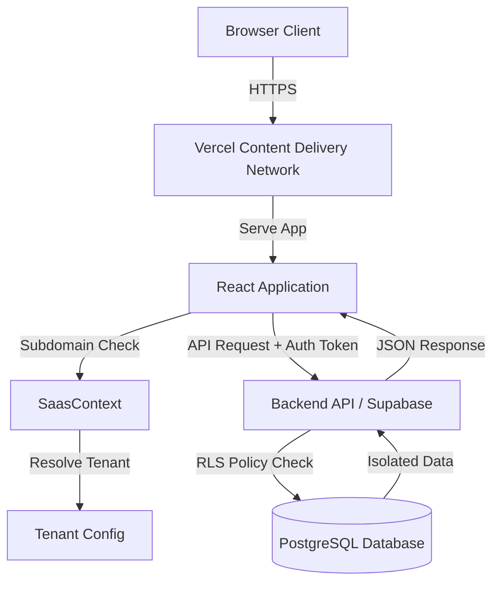

# Software Architecture Document: Sevasangraha HMS

This document provides a technical blueprint of the Sevasangraha Hospital Management System.

## Technology Stack
*   **Frontend**: React (Vite) + TypeScript + Tailwind CSS
*   **Backend**: Node.js (Express) or Supabase (Edge Functions)
*   **Database**: PostgreSQL
*   **Auth**: Supabase Auth / JWT
*   **Hosting**: Vercel (FE) + Supabase (BE)

## System Architecture Diagram

## How to Implement: Core Components

### 1. Frontend Architecture
*   **Entry Point**: `main.tsx` wraps the app in `SaasProvider` then `AuthProvider`.
*   **Routing**: `App.tsx` handles routes. Protected routes must check `isAuthenticated` AND `isModuleEnabled`.
    *   *Example*: If `isIpdEnabled` is false for a tenant, the `/ipd` route should redirect to 404.

### 2. Backend Design
*   **Controller Layer**: Validates input.
*   **Service Layer**: Business logic (e.g., "calculate detailed bill with tax").
*   **Data Layer (Prisma/Supabase)**: ALL queries must include `where: { orgId: tenantId }` explicit checks, even with RLS enabled, for double safety.

### 3. Data Flow Example: Patient Registration
1.  **UI**: User fills form at `magnus.app.com/patients/new`.
2.  **Context**: App attaches header `x-tenant-id: magnus`.
3.  **API**: Middleware validates that the logged-in user belongs to `magnus`.
4.  **DB**: Insert query runs: `INSERT INTO patients (name, org_id) VALUES ('John', 'org_magnus_id')`.

## Key Files
*   `src/contexts/SaasContext.tsx`: The heart of the multi-tenant logic.
*   `backend/prisma/schema.prisma`: The database definition.
*   `src/services/saasService.ts`: Tenant metadata fetcher.
